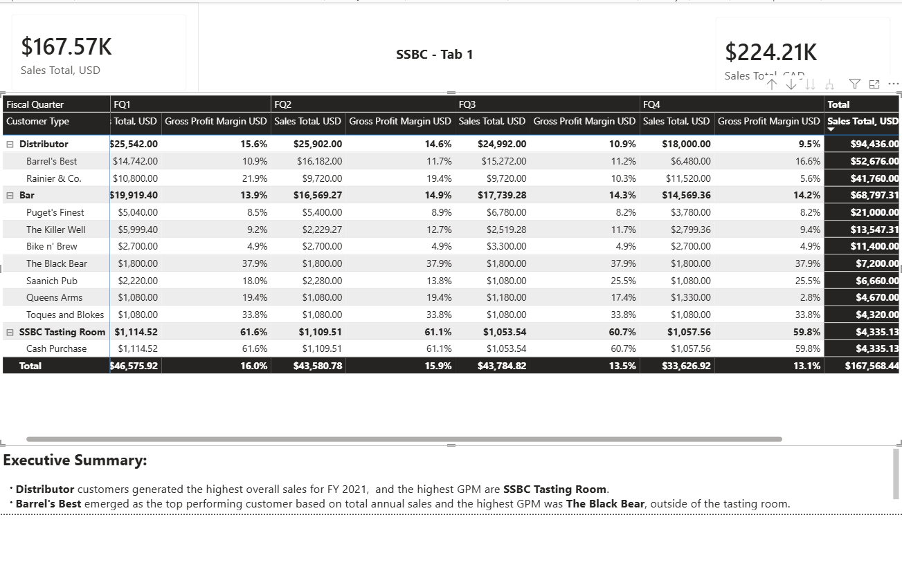
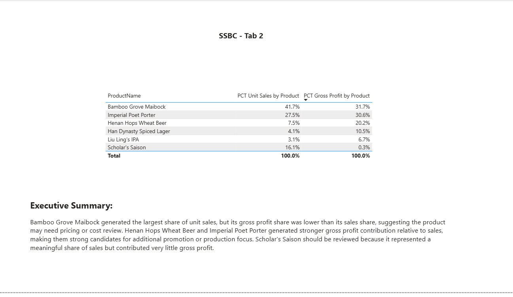
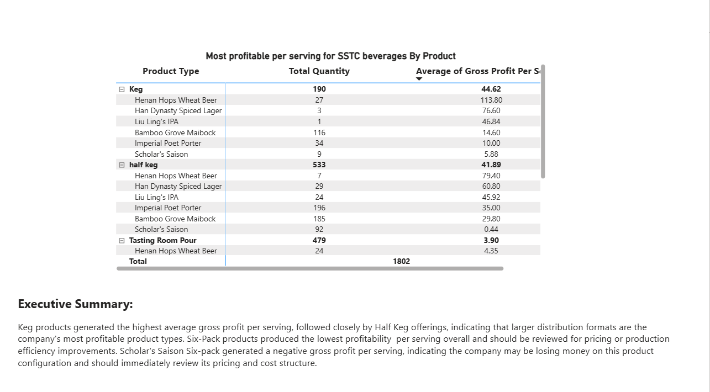
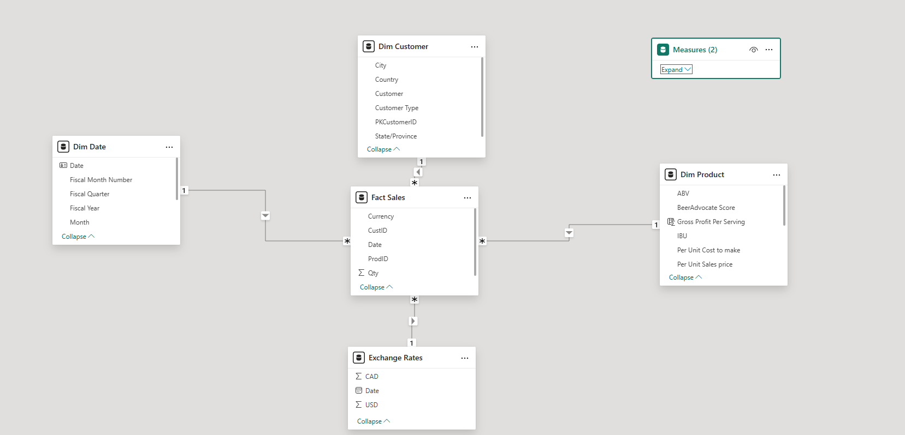

# Power BI Sales & Profit Analysis

Business intelligence dashboard built in Power BI featuring data modeling, DAX measures, KPI reporting, and profitability analysis.

## Project Overview

This project analyzes FY2021 sales, gross profit, and product profitability for SSBC using Power BI. The solution includes Power Query data transformation, dimensional modeling, DAX calculations, and executive dashboard reporting.

## Tools Used

* Power BI
* Power Query
* DAX
* Excel
* CSV/TXT/PDF data sources

## Dashboard Features

### Sales and GPM

* Sales KPI reporting
* Gross profit margin analysis
* Customer sales analysis
* Fiscal quarter performance tracking

### Gross Profit and Unit Sales

* Product sales contribution analysis
* Gross profit contribution analysis
* Product profitability comparisons

### Product Type Profitability

* Gross profit per serving analysis
* Product type profitability ranking
* Identification of low-margin and negative-profit products

## Key Skills Demonstrated

* Data transformation and cleansing
* Dimensional modeling
* DAX measure development
* KPI dashboard design
* Financial reporting
* Business intelligence analytics

## Dashboard Screenshots

### Sales and GPM

### Gross Profit and Unit Sales

### Product Type Profitability

## Data Model

The solution uses a star schema dimensional model with Fact Sales as the central fact table connected to customer, product, date, and exchange rate dimensions.

## Project Files

* Power BI dashboard (.pbix)
* Source data files (.zip)
* Dashboard screenshots

## Key Insights

- Distributor customers generated the strongest overall sales performance.
- Bamboo Grove Maibock drove the largest share of sales.
- Henan Hops Wheat Beer and Imperial Poet Porter showed stronger gross profit contribution relative to sales.
- Keg and Half Keg product types produced the highest average gross profit per serving.
